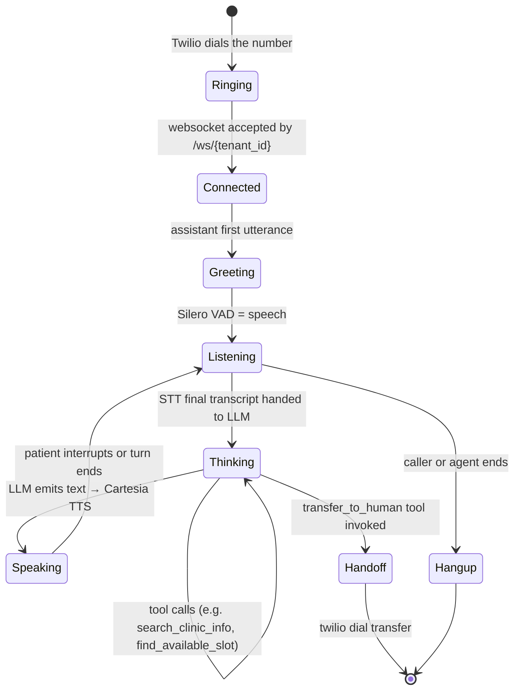
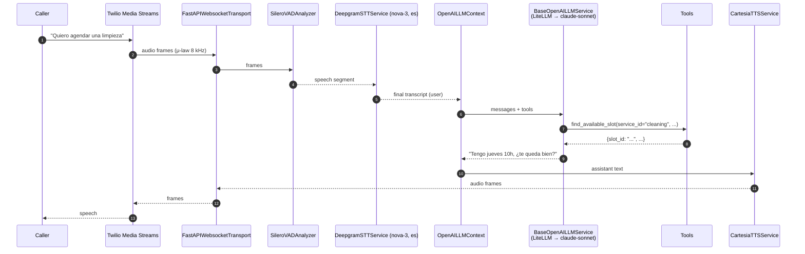

# voice-agent-es

[](LICENSE)
[](https://www.python.org)
[](https://github.com/pipecat-ai/pipecat)
[](https://deepgram.com)
[](https://cartesia.ai)
[](https://www.twilio.com/docs/voice/media-streams)

> **A Spanish-first AI receptionist you can plug into a Twilio phone number in under an hour.** Deepgram `nova-3` speech-to-text → Claude (or any LiteLLM-routed LLM) with a four-tool function-calling contract → Cartesia Spanish TTS, all orchestrated by Pipecat on a single FastAPI WebSocket. One process per tenant, per call.

Companion article: [Construir un recepcionista IA en español](https://numoru.com/en/contributions/recepcionista-ia-vapi-pipecat-espanol).

---

## Why

Voice beats text for Spanish-speaking SMBs: most customers call instead of type, and 24×7 pick-up is a night-and-day conversion move for clinics, dealerships, and real-estate agencies. Off-the-shelf voice agents are either English-first (Whisper defaults, US voices), overpriced, or don't expose the function-calling layer you need to actually *book* something.

`voice-agent-es` is opinionated about picking best-in-class components for each link of the chain and making the Spanish defaults first-class:

- **STT**: Deepgram `nova-3`, `language="es"` — low-latency multi-dialect Spanish.
- **TTS**: Cartesia `mx-female-warm-v1` (default) — Mexican Spanish, sub-300 ms first-byte.
- **LLM**: Any OpenAI-compatible model via a LiteLLM proxy (`claude-sonnet` by default).
- **Transport**: Twilio Media Streams serializer (8 kHz μ-law), so calls originate from a regular phone number.
- **Orchestration**: Pipecat `Pipeline` with Silero VAD and an OpenAI-style context aggregator.

---

## Stack choices at a glance

| Link | Choice | Why over alternatives |
|---|---|---|
| **STT** | Deepgram `nova-3` (`language="es"`) | Faster first-token than Whisper large on streaming audio; strong Spanish WER. Whisper is better offline-only; Google STT is per-utterance. |
| **TTS** | Cartesia `mx-female-warm-v1` | Sub-300 ms TTFB; MX Spanish voice. ElevenLabs has more voices but higher latency; Azure Neural is cheaper but sounds robotic in MX. |
| **Orchestration** | Pipecat `Pipeline` + Silero VAD | Production pipeline primitives (aggregator, VAD, transport) included. LiveKit Agents is comparable but brings a SFU you may not need; raw WebRTC pushes pipeline plumbing to you. |
| **LLM** | LiteLLM → Claude/Sonnet | One config line to swap providers; per-tenant rate limits and budget baked into LiteLLM. |
| **Transport** | Twilio Media Streams serializer | `serializer="twilio"` handles μ-law 8 kHz over a single WebSocket — no TURN server required. |

---

## Install

```bash
python -m venv .venv && source .venv/bin/activate
pip install -r requirements.txt
cp .env.example .env && $EDITOR .env
uvicorn app:app --host 0.0.0.0 --port 8765
```

`Dockerfile` included for container builds.

### Twilio TwiML

Point your Twilio phone number's voice webhook at a URL that returns:

```xml
<Response>
  <Connect>
    <Stream url="wss://voz.numoru.com/ws/clinica-123" />
  </Connect>
</Response>
```

The `clinica-123` path segment becomes the `tenant_id` passed into the pipeline (and into the Qdrant filter and the system prompt).

---

## Architecture

```mermaid
flowchart LR
    Caller[Caller PSTN] --> Twilio[Twilio phone number]
    Twilio -->|Media Streams μ-law 8 kHz| WS[FastAPI /ws/{tenant_id}<br/>app.py]
    WS --> Tport[FastAPIWebsocketTransport<br/>serializer=twilio<br/>SileroVADAnalyzer]
    Tport --> STT[DeepgramSTTService<br/>nova-3 · language=es]
    STT --> Agg[OpenAILLMContext.user_aggregator]
    Agg --> LLM[BaseOpenAILLMService<br/>via LiteLLM → claude-sonnet]
    LLM <-->|tool calls| Tools[search_clinic_info · find_available_slot<br/>book_appointment · transfer_to_human]
    LLM --> TTS[CartesiaTTSService<br/>mx-female-warm-v1 · es]
    TTS --> Tport
    Tport --> Twilio
    Twilio --> Caller
    LLM -.traces.-> LF[Langfuse]
    Tools -.RAG.-> Qd[(Qdrant<br/>collection kb_{tenant_id})]

    style STT fill:#d1fae5,stroke:#10b981
    style TTS fill:#fce7f3,stroke:#ec4899
    style LLM fill:#fef3c7,stroke:#d97706
    style Qd fill:#dbeafe,stroke:#2563eb
```

### Call lifecycle — state diagram



### A single turn — sequence



---

## Exposed function-calling tools (from `tools.py`)

| Tool | Required params | Purpose |
|---|---|---|
| `search_clinic_info` | `query` (string) | Retrieves services, pricing, hours, and FAQs from the tenant's RAG (Qdrant collection `kb_{tenant_id}`). |
| `find_available_slot` | `service_id`; optional `from_date`, `preferred_time` (`morning` / `afternoon` / `any`) | Returns a bookable calendar slot. |
| `book_appointment` | `patient_phone`, `patient_name`, `slot_id` | Confirms an appointment. |
| `transfer_to_human` | optional `reason` | Hands off the call to a human receptionist. |

The system prompt (from `prompts.py`) names the assistant **Rocío** and hard-codes the policy: never diagnose, never quote prices outside the RAG, confirm orally and via WhatsApp, clinic hours Mon–Sat 9–19.

---

## Latency budget (target)

End-to-end round-trip target on Numoru's production deployment. Treat as **targets**, not measurements — re-measure in your environment.

| Stage | Target | Notes |
|---|---|---|
| VAD + STT first token | 250 ms | Deepgram `nova-3` streaming |
| RAG (`search_clinic_info`) if triggered | 120 ms | Qdrant hybrid search, warm cache |
| LLM first token | 400 ms | Claude Sonnet via LiteLLM, warm |
| TTS first audio byte | 250 ms | Cartesia `mx-female-warm-v1` |
| **Total TTFA** (time-to-first-audio) | **~900–1200 ms** | Goal: under 1.2 s perceived silence |

Approximate **cost per call**: ≈ **0.11 USD** for a 2.5-minute call (STT + LLM + TTS). Re-validate with your own provider pricing.

---

## Configuration

| Env var | Required | Default | Description |
|---|---|---|---|
| `DEEPGRAM_KEY` | ✅ | — | Deepgram API key |
| `CARTESIA_KEY` | ✅ | — | Cartesia API key |
| `CARTESIA_VOICE` | — | `mx-female-warm-v1` | Cartesia voice ID |
| `LITELLM_MASTER_KEY` | ✅ | — | LiteLLM proxy key |
| `LITELLM_BASE_URL` | — | `https://api.numoru.com/v1` | LiteLLM proxy base URL |
| `LLM_MODEL` | — | `claude-sonnet` | Any LiteLLM-known model name |
| `QDRANT_URL` / `QDRANT_API_KEY` | optional | — | RAG source for `search_clinic_info` |
| `LANGFUSE_HOST` / `LANGFUSE_PUBLIC_KEY` / `LANGFUSE_SECRET_KEY` | optional | — | Langfuse tracing |

---

## Qdrant knowledge base

By convention the RAG collection is `kb_{tenant_id}`. Populate it with the clinic's FAQ, services list, pricing, and hours before going live. Use [`rag-production-stack`](https://github.com/numoru-ia/rag-production-stack) as the indexer.

---

## Observability

`langfuse==2.58.1` is pinned in `requirements.txt`. Wire a Pipecat observer that emits a Langfuse span per LLM turn and a root trace per call — one trace per `session_id`, one generation per LLM response. See sister library [`langfuse-go`](https://github.com/numoru-ia/langfuse-go) for the same pattern from Go.

---

## Best practices

- **One Pipecat pipeline per call, per tenant.** Don't share pipelines across tenants — the system prompt, tools, and Qdrant collection are tenant-scoped.
- **Never reuse `claude-opus` for voice** — it's too slow for real-time turns. Use Sonnet or Haiku and widen tool coverage instead.
- **Keep `system_prompt` short.** TTS perceives long prompts as long silences on barge-in.
- **Pin every dependency.** Voice pipelines are sensitive to minor STT/VAD bumps.
- **Put the FastAPI process behind a load balancer with sticky sessions** — WebSockets need affinity.

## Roadmap

- [ ] Built-in Langfuse observer wired into the Pipecat pipeline
- [ ] `transfer_to_human` implemented as a real Twilio `<Dial>` transfer
- [ ] Barge-in tuning presets per tenant
- [ ] Pre-flight prompt eval via [`agent-evals-template`](https://github.com/numoru-ia/agent-evals-template)
- [ ] WhatsApp parallel channel sharing the same tools

## License

Apache 2.0 — see [LICENSE](LICENSE).
